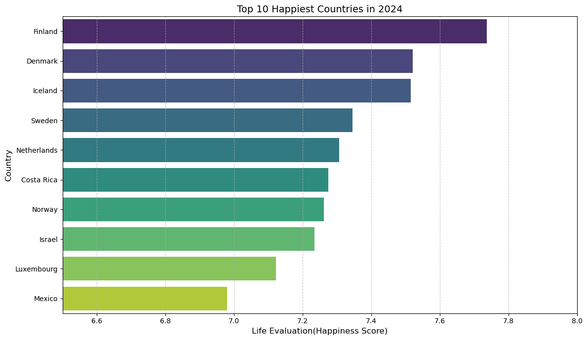
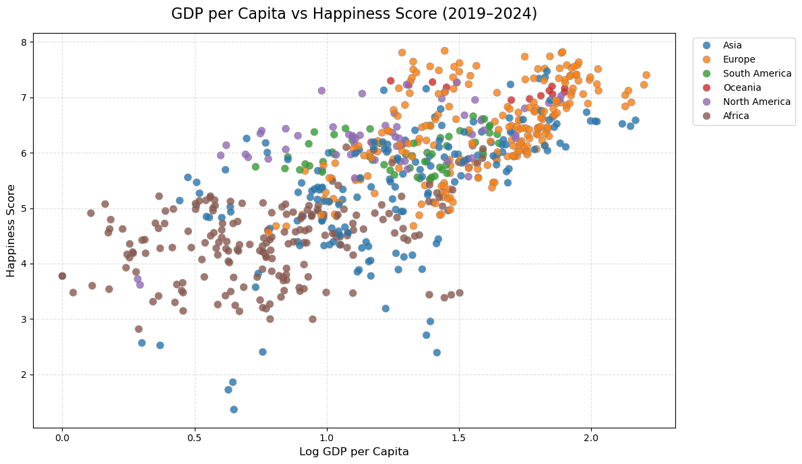
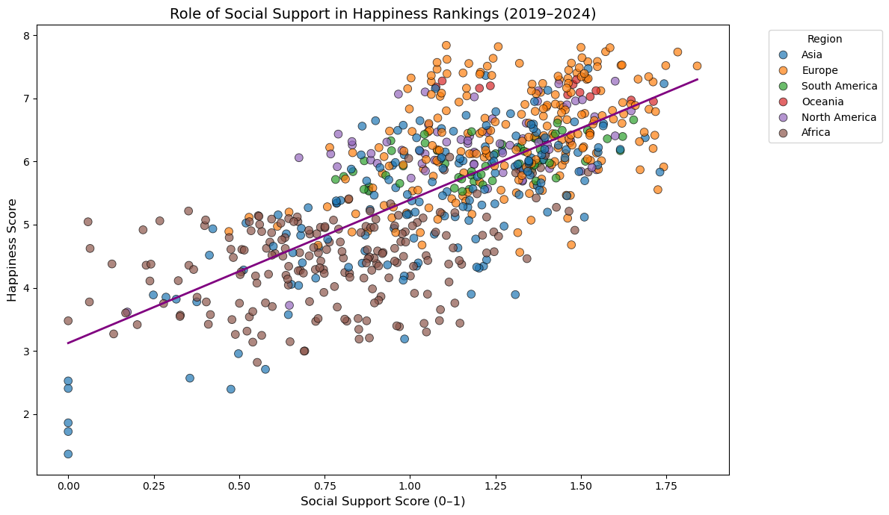
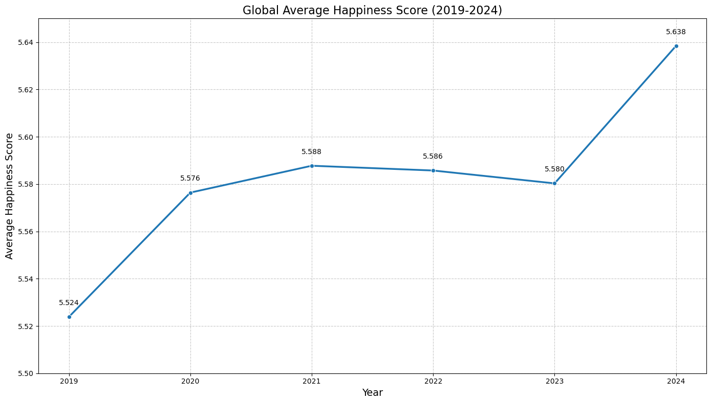
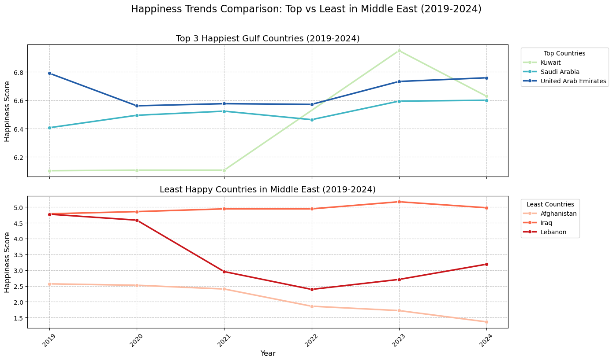
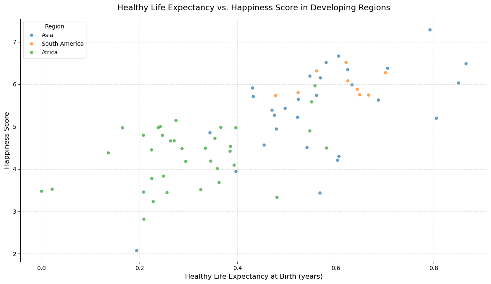
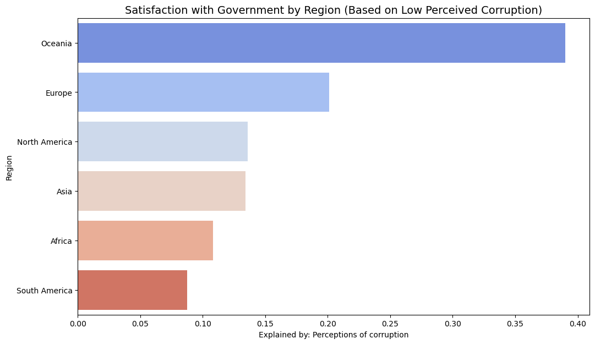

# World Happiness Data Analysis

## Overview

This project analyzes global happiness data from 2019–2024 using the Happiness Score (Life Evaluation) metric from the World Happiness Report.
It explores key factors such as social support, freedom, GDP, and healthy life expectancy to uncover correlations and regional differences influencing happiness rankings.

## Datasets

This project uses the following data sources:

- **World Happiness Report** (2025)  
  [Official site](https://www.worldhappiness.report/data-sharing/)
- **Population Data**  
  World Bank – Total Population (SP.POP.TOTL)  
  [Download CSV](https://data.worldbank.org/indicator/SP.POP.TOTL)
  - Note: This dataset was used only once in the analysis to compare happiness levels between countries with high and low population.

- **Country Regions**  
  ISO-3166 country codes with a custom region classification for analysis purposes.
  [GitHub reference](https://gist.github.com/REvans-kzn/5b0afcf00ed46abdc7324eda04b868b5?)

## The questions

1. Which are the top 10 happiest countries in 2024?
2. What are the regional differences in average happiness scores?
3. How do happiness levels differ between high- and low-density countries in 2024?
4. How strongly does average GDP per capita correlate with average happiness across countries?
5. What role does social support play in overall happiness rankings over the years?
6. What is the overall trend in the global average happiness score from 2019 to 2024?
7. How did happiness trends differ between the happiest and least happy Middle Eastern countries (2019–2024)?
8. How does healthy life expectancy influence happiness across developing regions?
9. How does perceived corruption vary across world regions, reflecting government satisfaction levels?

## Python Libraries Used :

- Pandas
- Numpy
- Seaborn
- Matplotlib

## The Analysis

Check out the project [here](WHR2025.ipynb)

### 1. Which are the top 10 happiest countries in 2024?

## Results

## Insight:

- Finland, Denmark, Iceland, Sweden, and Norway dominate the top 5, reflecting strong Nordic social systems and high life satisfaction.
- Costa Rica stand out as non-European entry, showing happiness can thrive beyond wealth through social and cultural factors.

- Luxembourg and Mexico highlight diverse drivers: economic prosperity in one, and strong community ties in the other.

### 2. What are the regional differences in average happiness scores?

## Results

## Insight:

- Oceania leads with the highest average happiness score , driven primarily by Australia and New Zealand.
- Europe and North America follow closely with strong scores , reflecting high social support and economic stability.
- Africa ranks lowest , highlighting significant gaps in well-being compared to other regions.

### 3. How do happiness levels differ between high- and low-density countries in 2024?

## Results

## Insight:

- Low-population countries show slightly higher median happiness scores compared to high-population countries.

- Happiness levels vary more in high-population countries, meaning some of these countries report very low happiness scores compared to others.

- Population size does not appear to be a direct determinant of happiness, as happiness levels overlap significantly between groups, indicating that other factors (such as income, social support, and health) play a stronger role.

### 4. How strongly does average GDP per capita correlate with average happiness across countries?

## Results

## Insight:

- There is a clear positive relationship between GDP per capita and happiness score: countries with higher log GDP per capita generally report higher happiness scores.

- Europe, North America, and Oceania cluster in the upper-right area of the plot, indicating both high income levels and high happiness scores compared to other regions.

- African countries are mostly concentrated in the lower-left area, reflecting lower GDP per capita and lower happiness scores, while Asia and South America show wider variability at mid-income levels.

### 5. What role does social support play in overall happiness rankings over the years?

## Results

## Insight:

- There is a clear positive relationship between social support and happiness, as countries with higher social support scores tend to report higher happiness scores across all regions .

- At similar levels of social support, regions differ in happiness outcomes, with Europe and Oceania generally achieving higher happiness scores than Africa and parts of Asia, suggesting that additional social, economic, or institutional factors influence overall well-being.

- Countries with medium levels of social support show greater variation in happiness scores, while those with high social support display more consistent and higher happiness levels, indicating a stabilizing effect of strong social support systems.

### 6. What is the overall trend in the global average happiness score from 2019 to 2024?

## Results

## Insight:

- The global average happiness score shows an overall upward trend from 2019 (5.524) to 2024 (5.638), indicating gradual improvement over time.

- After a steady rise from 2019 to 2021, there was a slight decline in 2022 and 2023, suggesting a temporary slowdown or external challenges affecting global well-being.

- 2024 records the highest average happiness score in the period, marking a strong rebound compared to the slight dip in the previous two years.

### 7. How did happiness trends differ between the happiest and least happy Middle Eastern countries (2019–2024)?

## Results

## Insight:

- Gulf countries consistently score much higher than the least happy Middle Eastern countries, showing a large and persistent happiness gap across the region throughout 2019–2024.

- Among the top performers, Kuwait shows the most volatility with a sharp increase around 2022–2023, while Saudi Arabia and the UAE follow more stable and gradual upward trends.

- In contrast, Afghanistan and Lebanon experience severe declines around 2021–2022, with only partial recovery afterward, highlighting the long-term impact of political and economic instability on well-being.

### 8. How does healthy life expectancy influence happiness across developing regions?

## Results

## Insight:

- There is a clear positive relationship between healthy life expectancy and happiness: countries with longer healthy lives tend to report higher happiness scores across all developing regions.

- African countries cluster at lower levels of healthy life expectancy and happiness, indicating more constrained health conditions are closely associated with lower well-being outcomes.

- Asian and South American countries generally show higher happiness scores at similar or higher levels of healthy life expectancy, with South America standing out for relatively high happiness despite moderate health levels.

### 9. How does perceived corruption vary across world regions, reflecting government satisfaction levels ?

## Results

## Insight:

- Oceania shows the highest satisfaction with government (based on low perceived corruption), significantly outperforming all other regions.

- Europe ranks second, while North America and Asia fall in the mid-range with relatively similar levels of perceived government integrity.

- Africa and South America report the lowest satisfaction levels, suggesting higher perceived corruption and weaker public trust in government compared to other regions.

## Conclusion

This exploration of the World Happiness Report has revealed key drivers of well-being, regional disparities, and evolving trends across time and geography. The insights deepen our understanding of what fosters happiness globally and highlight actionable factors like social support, corruption perception, and health expectancy. As global challenges persist, ongoing analysis remains vital to inform policy and personal growth. This project lays a strong foundation for future research, emphasizing the value of data-driven approaches to improving quality of life.
